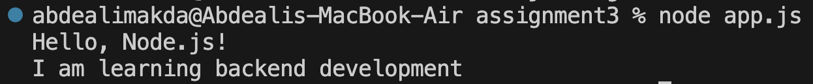
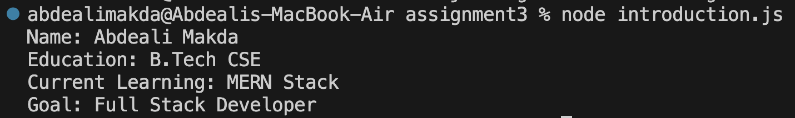

# NodeJS Basics Assignment

## Assignment Description

This assignment is based on the basics of Node.js. The purpose of this assignment is to create and run simple Node.js programs and display output in the terminal using `console.log()`.

The assignment contains two programs:

1. `app.js` - Displays basic Node.js messages.
2. `introduction.js` - Displays my personal introduction.

---

## Project Structure

```text
NodeJS-Basics-Assignment
│
├── app.js
├── introduction.js
└── README.md
```

---

# Task 1: First Node.js Program

The first program displays two simple messages in the terminal using `console.log()`.

### File Name

```text
app.js
```

### Code

```javascript
console.log("Hello, Node.js!");
console.log("I am learning backend development");
```

### Steps to Run

1. Open the project folder in VS Code.
2. Open the terminal.
3. Make sure you are inside the project folder.
4. Run the following command:

```bash
node app.js
```

### Expected Output

```text
Hello, Node.js!
I am learning backend development
```

### Output Screenshot



---

# Task 2: Introduction Program

The second program displays my personal details using `console.log()`.

### File Name

```text
introduction.js
```

### Code

```javascript
console.log("Name: Abdeali Makda");
console.log("Education: B.Tech CSE");
console.log("Current Learning: MERN Stack and Node.js");
console.log("Goal: Full Stack Developer");
```

### Steps to Run

1. Open the terminal in the project folder.
2. Run the following command:

```bash
node introduction.js
```

### Expected Output

```text
Name: Abdeali Makda
Education: B.Tech CSE
Current Learning: MERN Stack and Node.js
Goal: Full Stack Developer
```

### Output Screenshot



---

# Commands Used

The following commands were used to execute the programs:

```bash
node app.js
node introduction.js
```

---

# Conclusion

This assignment helped me understand how to create a basic Node.js program, execute JavaScript files using Node.js, and display information in the terminal using `console.log()`.
