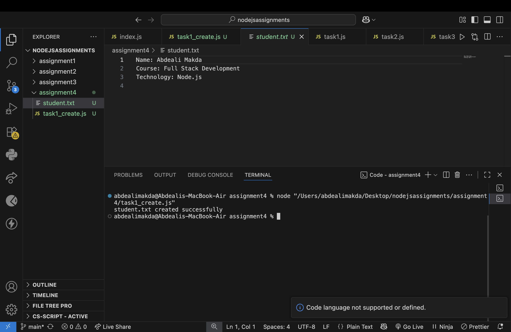
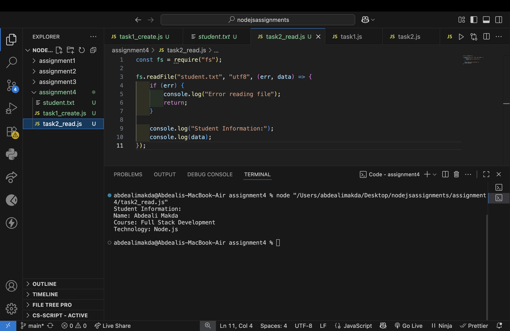
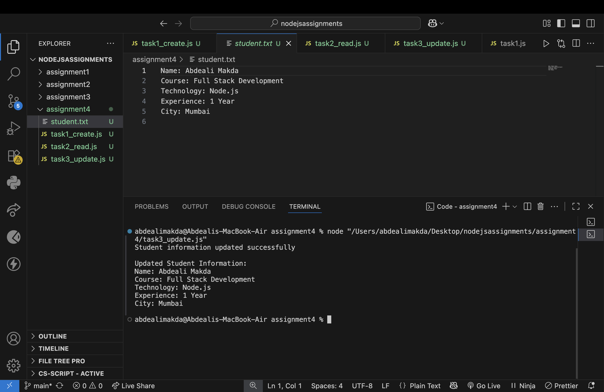
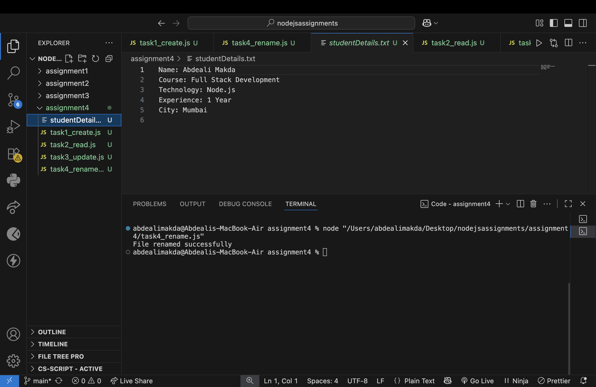
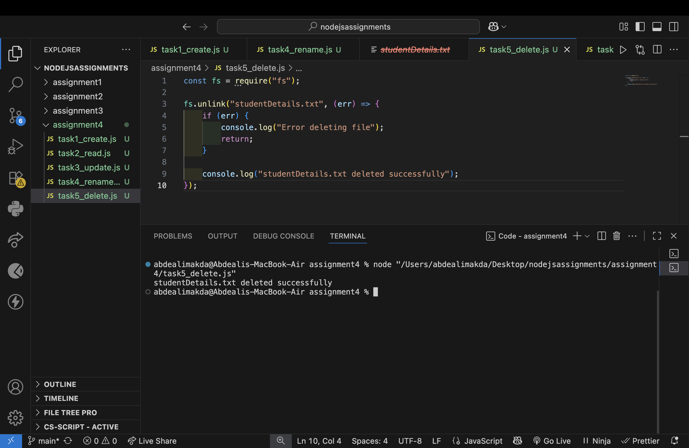

# Node.js File System Assignment

## Student Information

**Name:** Abdeali Makda
**Course:** Full Stack Development
**Technology:** Node.js

---

## Objective

This assignment demonstrates basic file handling operations in Node.js using the built-in `fs` module.

The assignment is divided into five tasks:

1. Create a file
2. Read the file
3. Update the file
4. Rename the file
5. Delete the file

Each task is implemented in a separate JavaScript file.

---

# Task 1 — Create File

### File Used

`task1_create.js`

### Description

The program uses `fs.writeFile()` to create a file named `student.txt` and store student information in it.

### Code

```javascript
const fs = require("fs");

const student = `Name: Abdeali Makda
Course: Full Stack Development
Technology: Node.js
`;

fs.writeFile("student.txt", student, (err) => {
    if (err) {
        console.log("Error creating file");
        return;
    }

    console.log("student.txt created successfully");
});
```

### Output

The program successfully creates `student.txt`.

### Screenshot



---

# Task 2 — Read File

### File Used

`task2_read.js`

### Description

The program uses `fs.readFile()` to read the contents of `student.txt` and display the student information in the terminal.

### Output

The contents of the file are displayed successfully.

### Screenshot



---

# Task 3 — Update File

### File Used

`task3_update.js`

### Description

The program uses `fs.appendFile()` to add additional information to the existing `student.txt` file without removing the existing content.

The following information is added:

* Experience: 1 Year
* City: Kolkata

### Output

The updated student information is displayed successfully.

### Screenshot



---

# Task 4 — Rename File

### File Used

`task4_rename.js`

### Description

The program uses `fs.rename()` to rename the file from:

`student.txt`

to:

`studentDetails.txt`

### Output

The file is successfully renamed.

### Screenshot



---

# Task 5 — Delete File

### File Used

`task5_delete.js`

### Description

The program uses `fs.unlink()` to delete `studentDetails.txt`.

### Output

The file is successfully deleted.

### Screenshot



---

# File System Methods Used

| Method            | Purpose                           |
| ----------------- | --------------------------------- |
| `fs.writeFile()`  | Creates and writes data to a file |
| `fs.readFile()`   | Reads data from a file            |
| `fs.appendFile()` | Adds data to an existing file     |
| `fs.rename()`     | Renames a file                    |
| `fs.unlink()`     | Deletes a file                    |

---

# File Flow

```text
Task 1
student.txt created
        ↓
Task 2
student.txt read
        ↓
Task 3
student.txt updated
        ↓
Task 4
student.txt renamed to studentDetails.txt
        ↓
Task 5
studentDetails.txt deleted
```

---

# Error Handling

Error handling has been included in every file system operation. If an operation fails, an appropriate error message is displayed in the terminal.

---

# Conclusion

This assignment demonstrates the basic file system operations available in Node.js using the built-in `fs` module. The program successfully creates, reads, updates, renames, and deletes a file.
